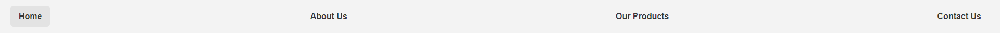
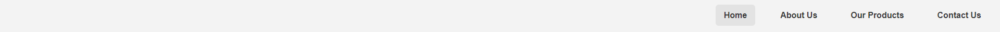
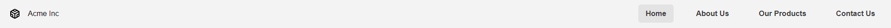

### Opdracht 1a
De navigatie moet een horizontale layout krijgen, waarbij de buttons evenredig afstand krijgen en ze verticaal aligned zijn. Zie onderstaande afbeelding voor het gewenste resultaat.


Om dit te bereiken mag je ergens in de bestaande classes in `styles.css` de volgende flexbox properties declareren. Declareer de properties aan de juiste class en geef de juiste waardes mee.

```
display: _____;
justify-content: _____;
align-items: _____;
```
#### Oplossingen
Loop je vast en wil je de oplossing bekijken? Klik dan op onderstaande knop.
<details>
<summary>Bekijk aan welke class je het toevoegt</summary>
<pre>
.navbar-list {

}
</pre>  
</details>
<details>
<summary>Bekijk de flexbox waardes</summary>
<pre>
display: flex;
justify-content: space-between;
align-items: center;
</pre>  
</details>

### Opdracht 1b
De navigatie moet een horizontale layout krijgen, waarbij de buttons een vaste afstand krijgen van `2rem`, rechts in de navigatie worden gepositioneerd en ze verticaal aligned zijn. Zie onderstaande afbeelding voor het gewenste resultaat.


Om dit te bereiken mag je ergens in de bestaande classes in `styles.css` de volgende flexbox properties declareren. Declareer de properties aan de juiste class en geef de juiste waardes mee.

```
display: _____;
justify-content: _____;
align-items: _____;
_____: 2rem;
```
#### Oplossingen
Loop je vast en wil je de oplossing bekijken? Klik dan op onderstaande knop.
<details>
<summary>Bekijk aan welke class je het toevoegt</summary>
<pre>
.navbar-list {

}
</pre>  
</details>
<details>
<summary>Bekijk de flexbox waardes</summary>
<pre>
display: flex;
justify-content: flex-end;
align-items: center;
gap: 2rem
</pre>  
</details>

### Opdracht 1c
Je kunt de css stijl van de vorige opdracht kopiëren. De navigatie heeft nu ook een logo gekregen en ook deze moet een horizontale layout krijgen en een vaste afstand krijgen van `1rem` voor het icoontje en de naam van het bedrijf. Zorg ervoor dat de ruimte tussen het logo en de navigatie de ruimte delen en ze beide verticaal aligned zijn. Zie onderstaande afbeelding voor het gewenste resultaat.


Om dit te bereiken mag je ergens in de bestaande classes in `styles.css` de volgende flexbox properties declareren. Declareer de properties aan de juiste **_3 classes_** en geef de juiste waardes mee.

```
display: _____;
justify-content: _____;
```
```
display: _____;
align-items: _____;
_____: 1rem;
```
```
display: _____;
justify-content: _____;
align-items: _____;
_____: 2rem;
```
#### Oplossingen
Loop je vast en wil je de oplossing bekijken? Klik dan op onderstaande knop.
<details>
<summary>Bekijk aan welke class je het toevoegt</summary>
<pre>
.navbar {

}

.navbar-logo {

}

.navbar-list {

}
</pre>  
</details>
<details>
<summary>Bekijk de flexbox waardes</summary>
<pre>
display: flex;
justify-content: space-between;
</pre>
<pre>
display: flex;
align-items: center;
gap: 1rem;
</pre>
<pre>
display: flex;
justify-content: flex-end;
align-items: center;
gap: 2rem;
</pre>  
</details>
